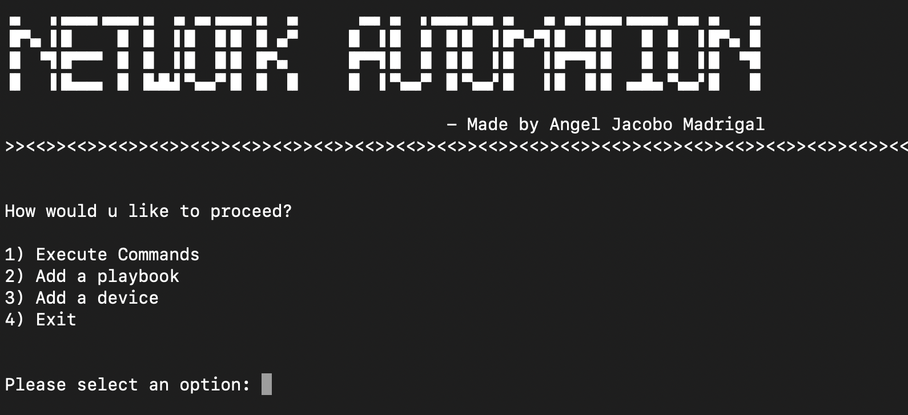
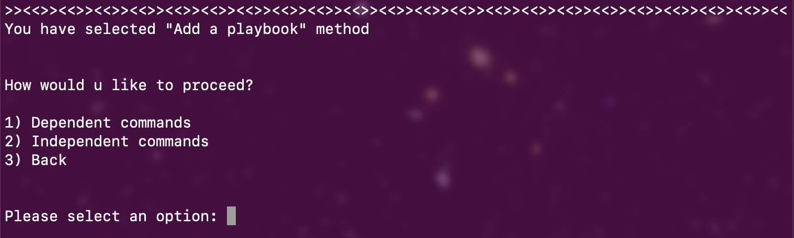
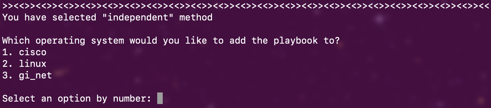
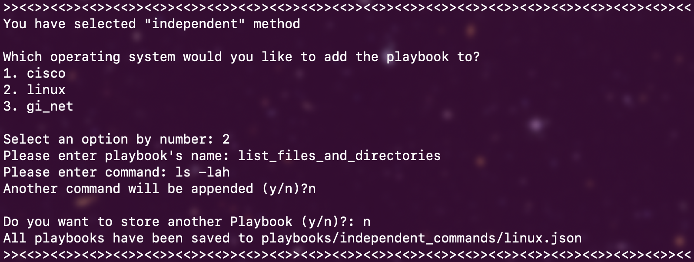
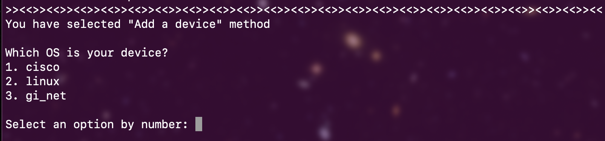
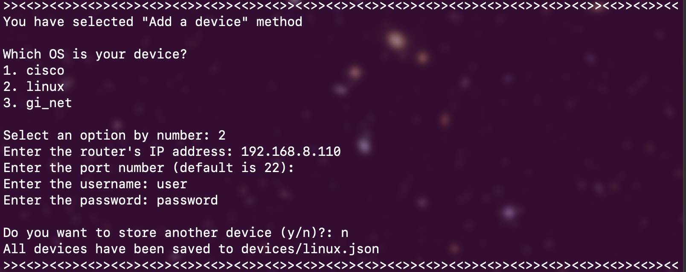
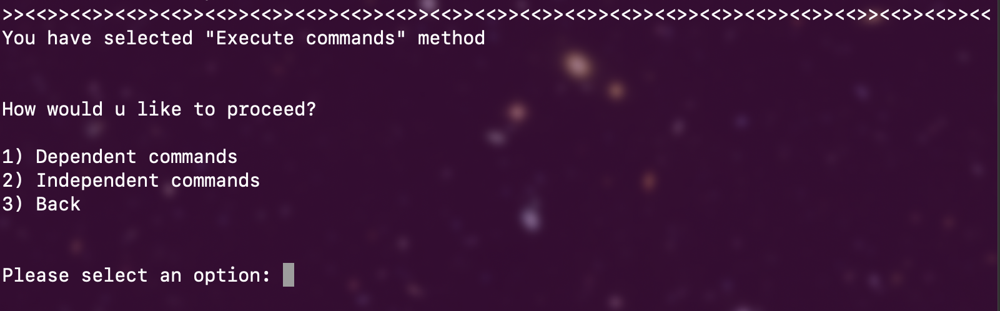
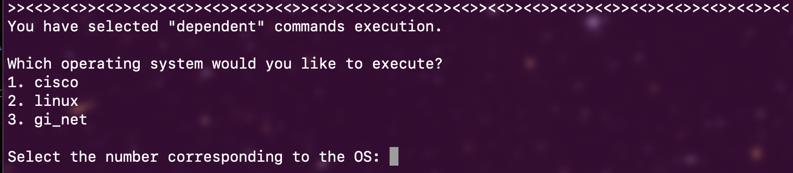
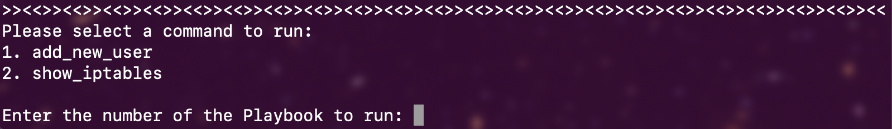

# Network Automation Project

## Overview

This repository focuses on **network automation** using Python, implementing features like **multithreading** and **asynchronous command execution** to efficiently manage multiple devices. The project is designed to automate complex tasks on network devices, including executing commands across multiple devices in parallel, managing playbooks with dependent command sets, and troubleshooting network issues.

## Features

- **Multithreading & Asynchronous Execution**: Efficiently handle multiple device connections and command execution in parallel.
- **Playbook Management**: Create, store, and load playbooks to execute complex, dependent command sets across devices.
- **Linux Iptables Automation**: Automate firewall configurations and rules on Linux machines.
- **Project Management & Troubleshooting**: Focus on building robust, scalable solutions for multi-device management and troubleshooting network-related issues.

## Technologies

- **Python**: Core language for automation.
- **Paramiko**: For SSH-based communication with network devices.
- **AsyncSSH**: To handle asynchronous communication for larger networks.
- **Multithreading**: For concurrent execution of commands on multiple devices.

## Installation

1. Clone the repository:
   ```bash
   git clone https://github.com/jacob-MX/network_automation.git
   cd network-automation
   ```

2. Install the required Python libraries:
   ```bash
   pip install -r requirements.txt
   ```

## Usage

### Example of Running the Script

1. Edit the `devices` and `commands` list in the script to match your network setup.

2. Run the `main.py` file:
   ```bash
   python main.py
   ```

3. Choose from the menu options to create, load, or execute a playbook.


## Project Structure

```
.
├── main.py               # Entry point to the project
├── ssh_manager.py        # Handles SSH connections and multithreading
├── utils.py              # Utility functions for various operations
├── playbooks/            # Directory to store and manage playbooks
│   ├── dependent_commands/
│   │   ├── cisco.json
│   │   ├── gi_net.json
│   │   └── linux.json
│   └── independent_commands/
│       ├── cisco.json
│       ├── gi_net.json
│       └── linux.json
├── devices/              # Directory to store device configurations
│   ├── cisco.json
│   ├── gi_net.json
│   └── linux.json
├── README.md             # This file
└── requirements.txt      # Python dependencies

```

## Playbooks

Playbooks allow you to group dependent commands to be executed across multiple devices. You can create, load, and manage playbooks through the command-line interface provided by this project.

### Step 1: Select the type of commands you want to store in playbooks


### Step 2: Specify the operating system for your commands


### Step 3: Insert the name of the playbook and the commands in sequence


### Example of how playbooks will be stored

```json
[
    {
        "add_new_user": [
            "sudo su",
            "0000",
            "useradd -m -s /bin/bash newuser",
            "echo 'newuser:1234' | chpasswd",
            "usermod -aG sudo newuser",
            "passwd -e newuser"
        ]
    },
    {
        "show_iptables": [
            "sudo su",
            "0000",
            "iptables -L -v -n"
        ]
    }
]
```

## Devices

### Step 1: Select the OS group for the devices where you want to store


### Step 2: Enter credentials, IP, password, username, and port


### Example of how devices will be stored

```json
[
    {
        "hostname": "192.168.8.110",
        "port": "22",
        "username": "user1",
        "password": "password"
    },
    {
        "hostname": "192.168.8.120",
        "port": "22",
        "username": "user2",
        "password": "password"
    }
]
```

## Command Execution

### Step 1: Select the type of command you want to execute (dependent or independent commands)


### Step 2: Select the group of devices


### Step 3: Select the playbook to execute


## Contributing

Contributions are welcome! Please submit a pull request or open an issue if you'd like to collaborate.

